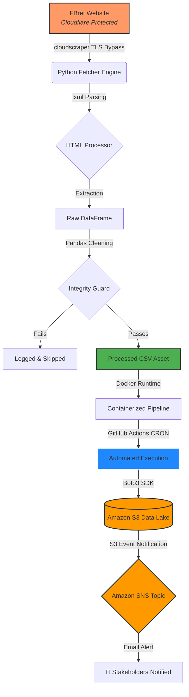

# ⚽ EPL-DATA-PIPELINE
### 🚀 Production-Grade ETL & Analytics System

 
   
   
   
   

## 📌 Overview
A robust, cloud-native, automated **Data Engineering pipeline** that collects, processes, and analyzes English Premier League (EPL) data in real-time. This system transforms a static scraping script into a resilient production ecosystem.

---

## 🏗️ System Architecture

The pipeline is built on a modular, decoupled architecture to ensure high availability and data integrity.

### 🧱 Architectural Layers

#### 1️⃣ Data Ingestion Layer (`fetcher.py`)
* **Technology:** `cloudscraper`
* **Features:** TLS handshake & JS challenge resolution, Cloudflare bypass, and Chrome (Windows) browser impersonation.

#### 2️⃣ Data Processing Layer (`scraper.py` & `cleaning.py`)
* **Parsing:** HTML parsing via `lxml`.
* **Transformation:** Data normalization with `pandas`.
* **Validation:** Schema enforcement (e.g., `pts` → `points`) and missing value handling.

#### 3️⃣ Analytics Layer
* **Top 4 Probability Model:** A lightweight statistical scoring system based on Points Per Game (PPG) and Goal Difference (GD).

#### 4️⃣ Orchestration & Monitoring
* **Automation:** **GitHub Actions** daily CRON execution (`0 0 * * *`).
* **Cloud Persistence:** Secure data storage in **Amazon S3**.
* **Alerting:** **Amazon SNS** publishes instant email notifications to stakeholders upon successful upload.

---

## 🛠️ Technology Stack

| Layer | Technology |
| :--- | :--- |
| **Scraping** | `cloudscraper`, `requests` |
| **Processing** | `pandas`, `lxml` |
| **Cloud Storage** | `AWS S3` |
| **Alerts** | `Amazon SNS` |
| **Containerization** | `Docker` |
| **Orchestration** | `GitHub Actions` |

---

## 🛡️ Engineering & DevOps Standards

* **🔒 Zero-Leakage Security:** Credentials are never committed. We use `.gitignore`, `python-dotenv` for local dev, and **GitHub Secrets** for production.
* **📊 Professional Logging:** Centralized via `utils/logger.py` with UTF-8 encoding (emoji-safe) and structured logging levels.
* **🐳 Containerization:** The entire pipeline is containerized via a lightweight `Dockerfile`. The master controller (`main.py`) ensures "it works on my machine" translates to the cloud.
* **🌿 Professional Git Workflow:** Strict Feature Branching Strategy (`feature/*`) ensures production stability.

---

## 🚀 Deployment & Usage

### 1. Prerequisites
- Python 3.12+
- Docker Desktop
- AWS Account (S3 Bucket & SNS Topic configured)

### 2. Local Setup
powershell
git clone [https://github.com/JacobDarkorAppiah/epl-data-pipeline.git](https://github.com/JacobDarkorAppiah/epl-data-pipeline.git)
cd epl-data-pipeline
pip install -r requirements.txt
### 3. Environment Configuration
Create a .env file in the root directory:

- AWS_ACCESS_KEY_ID=your_access_key
- AWS_SECRET_ACCESS_KEY=your_secret_key
- AWS_REGION=your_region
- S3_BUCKET_NAME=your_bucket_name

### 4. Run with Docker
-PowerShell
-docker build -t epl-pipeline .
-docker run --env-file .env epl-pipeline

# 🏆 Project Author # Jacob Darkor Appiah 

Data Engineer | Python Developer | Cloud Practitioner| Codveda Technologies Data Science Intern
